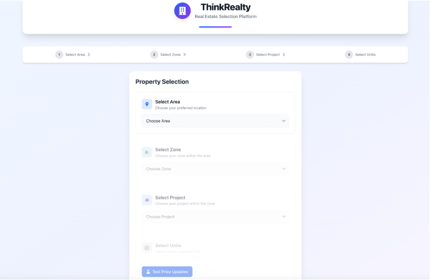
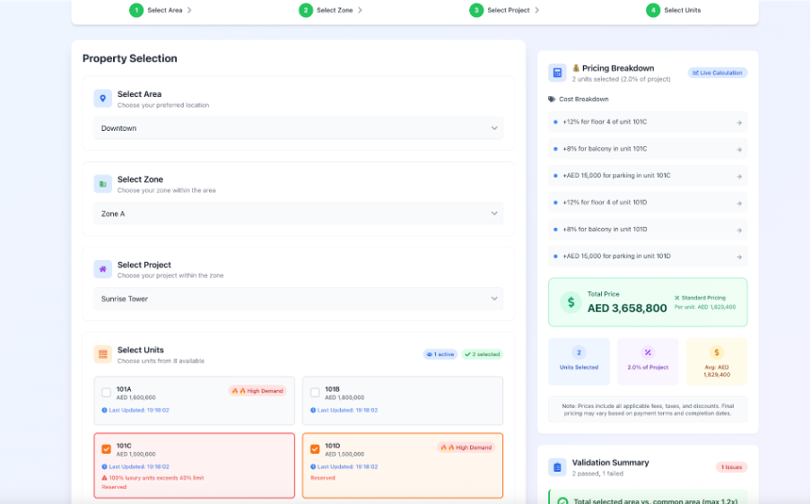
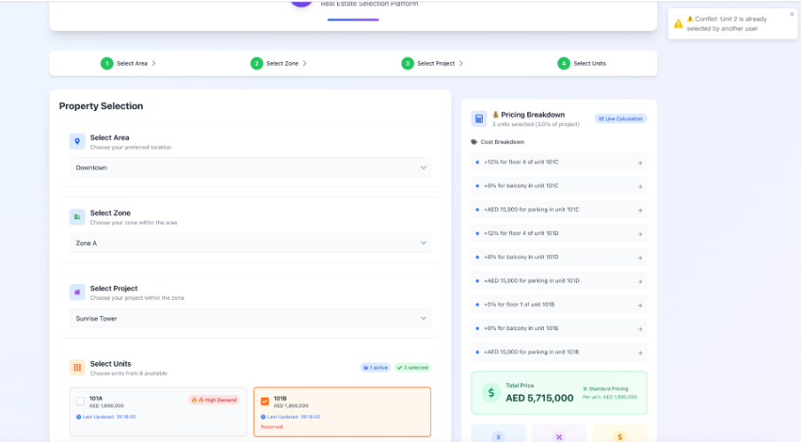
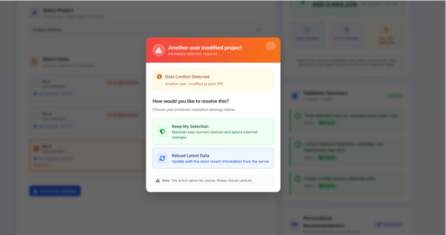
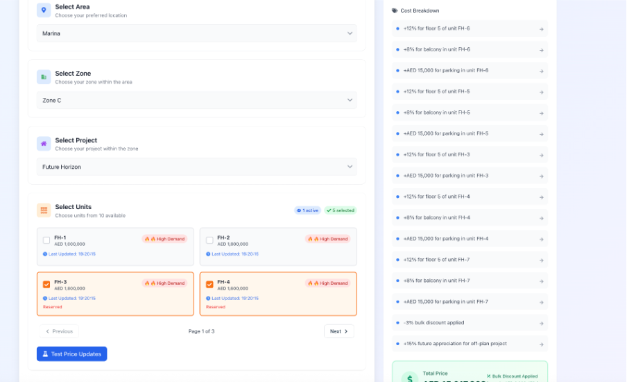
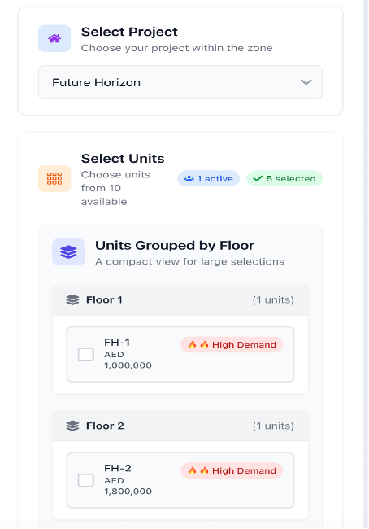
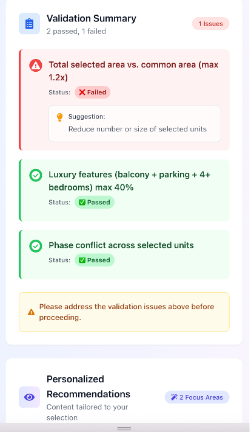
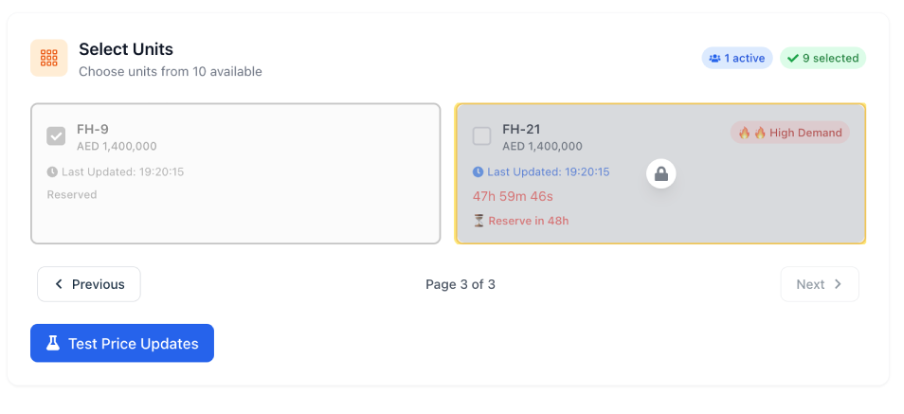

# 🏡 ThinkRealty Frontend Assessment

A real estate selection platform that allows users to select areas, zones, projects, and residential units with dynamic pricing logic, availability management, real-time validation, and multilingual support (English/Arabic).

---

## 📦 1. Setup Instructions

### 1.1 Step-by-Step Installation Guide

1. **Clone the Repository**
   ```bash
   git clone https://github.com/yourusername/thinkRealty-crm-system.git
   cd think-realty-app
   ```

2. **Install Dependencies**
   ```bash
   npm install
   ```

3. **Run the App Locally**
   ```bash
   npm run dev
   ```

4. **Open in Browser**
   Visit [http://localhost:5173/](http://localhost:5173/)

### 1.2 Prerequisites and Dependencies

- Node.js `^18.x`
- npm `^9.x`
- Git (for cloning repo)
- Modern browser (Chrome, Edge, etc.)

### 1.3 Environment Variables

> No external API used. No `.env` file is required.

---

## ⚙️ 2. Technology Stack

### 2.1 Core Technologies

| Technology      | Version  | Purpose                        |
|----------------|----------|--------------------------------|
| React           | ^18.x    | Core frontend framework        |
| TypeScript      | ^5.x     | Type safety                    |
| Redux Toolkit   | ^1.9.x   | Global state management        |
| Tailwind CSS    | ^3.x     | Styling & responsiveness       |
| Heroicons / React Icons | ^4.x | Icons                      |


### 2.2 Utilities

- Custom `useTranslate()` hook for multilingual support
- `ValidationEngine` and `ConflictDetector` for business rules and real-time changes

---

## 📚 3. Assumptions Made

### 3.1 Business Logic Assumptions

- **Bulk Discount**: Triggered when >30% of units in a project are selected
- **Luxury Limit**: No more than 40% of selected units may include balcony, parking, and 4+ bedrooms
- **Future Appreciation**: Applied when an off-plan project has >18 months to completion
- **Area Rule**: Total selected unit area cannot exceed 1.2× common area

### 3.2 Ambiguity Handling

- No backend was provided, so mocked data for `areas`, `zones`, `projects`, and `units` was used
- Assumed all unit statuses, updates, and pricing differences are simulated

### 3.3 Simplifications

- Unit reservation is local-only (non-persistent)
- Timers run in client-side memory only

---

## 🖼️ 4. Screenshots and Descriptions

> *(Screenshots are attached in the provided Word document. Below are captions and contexts.)*

### 📍 4.1 Initial Project Selection
**Description**: The user starts the property selection process by choosing Area → Zone → Project.

--- 

### 🏢 4.2 Unit Selection + Pricing Breakdown
**Description**: Real-time pricing logic including modifiers like floor level, balcony, parking, and discount rules.

--- 

### 🛎️ 4.3 Notification System
**Description**: Displays toast-style alerts when price changes or unit conflicts are detected.

--- 
--- 

### 📱 4.4 Responsive Layout Modes
**Description**: When many units are selected or on mobile, the view switches to "Grouped by Floor" mode.

--- 
--- 
--- 

### ⚠️ 4.5 Conflict & Error Handling
**Description**: Locked units with countdowns and disabled selection. Shows unit demand indicators (🔥 High Demand).


--- 

## 🧩 5. Incomplete Items & Future Enhancements

### 5.2 Future Enhancements

- Persist countdowns across sessions
- Integrate socket.io for live updates
- Add unit search, filter, and sort functionality

---

## ⏱️ 6. Time Tracking

### Total Time Spent: ~18 hours

#### Breakdown

| Component                        | Time Spent |
|----------------------------------|-------------|
| Redux Store & Setup              | 3h          |
| Unit Selection & Pricing Logic   | 4h          |
| Countdown & Conflict Handling    | 3h          |
| Validation Engine Implementation | 2h          |
| Compact Layout View              | 3h          |
| Multilingual Support (EN/AR)     | 2h          |
| UI Design & Styling              | 4h          |

---

## 📁 Folder Structure (Simplified)

```
/src
  /components
    AreaSelector.tsx
    ProjectSelector.tsx
    UnitMultiSelect.tsx
    PricingBreakdown.tsx
    ZoneSelector.tsx
    ValidationSummary.tsx
    SmartNotificationCenter.tsx
    ConflictResolutionModal.tsx
    useSimulatePriceChange.tsx
    TimerDisplay.tsx
    DropdownSelector.tsx
  /hooks
    useTranslate.ts
  /store
    landingPageSlice.ts
    Store.ts
  /utils
    calculateComplexPricing.ts
    detectPriceChangesAndConflicts.ts
    runValidationChain.ts
    calculateOptimalLayout.ts
    generatePersonalizationConfig.ts
    handleAvailabilityCascade.ts
    AdaptiveLayoutManager.tsx
  /data
    data.ts
```

